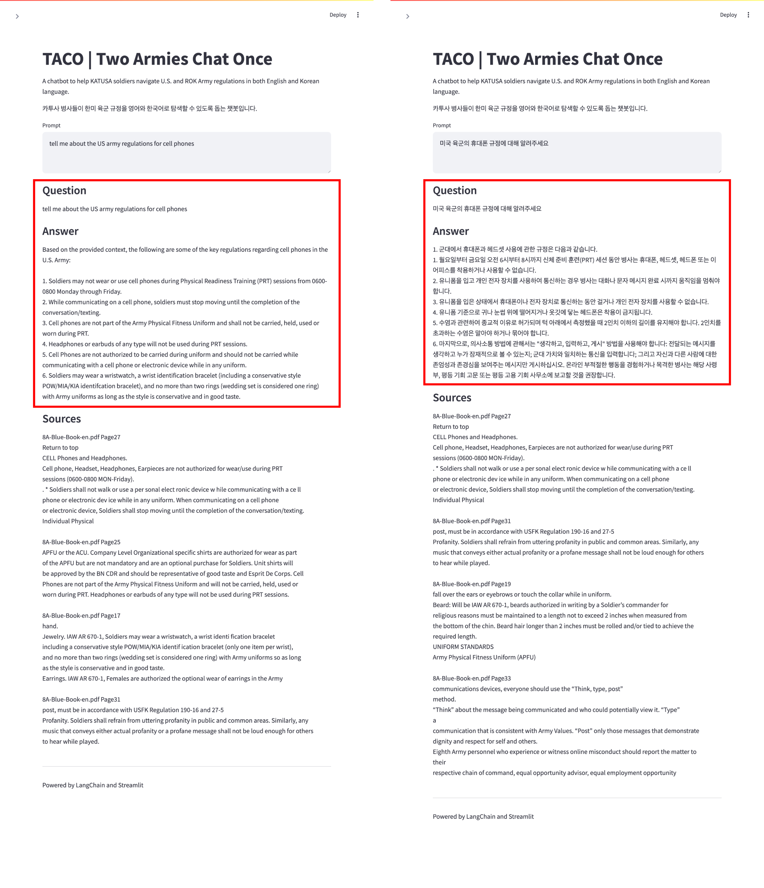

# TACO: Two Armies, Chat Once
 

  <strong>A Multilingual RAG Chatbot for Regulations of the US Army and ROK Army</strong>
   
   
  
  
   
  
  
  
   
  
  
  
  

 

[demo.webm](https://github.com/user-attachments/assets/6b818b4d-6e78-444d-8fed-a73401ebc6d7)

 

  <strong>Try below badges</strong>
   
   
  
  

 

# Introduction

TACO (Two Armies Chat Once) aims to develop a chatbot powered by Retrieval-Augmented Generation (RAG) architecture using LangChain and Streamlit, designed to provide clear and accurate answers in both English and Korean.
 

 
<b>What's KATUSA</b>

  
In South Korea, there is a unique military program known as KATUSA ([Korean Augmentation to the United States Army](https://en.wikipedia.org/wiki/Korean_Augmentation_to_the_United_States_Army)). Although KATUSA soldiers are South Korean citizens, they are assigned to U.S. Army units and operate under U.S. Army command.

 
<b>Why do KATUSA soldiers need this?</b>

Due to the unique structure of KATUSA program, KATUSA soldiers are required to follow both U.S. Army regulations and ROK Army (Republic of Korea Army) regulations. However, these two sets of regulations are sometimes incompatible, leading to confusion about the cultural and procedural differences between the two military systems.
 

 

<table>
  <tr>
     <td>
      <h3 align='center'>
        Multilingual Support
      </h3>
    </td>
  </tr>
  <tr>
    <td style="width:1/2;">
      
    </td>
  </tr>
</table>
 

# implementation

<table>
  <tr>
     <td>
      <h3 align='center'>
        Multilingual Support
      </h3>
    </td>
  </tr>
  <tr>
    <td style="width:1/2;">
      
    </td>
  </tr>
</table>
 

# Contribution

<!--
https://contrib.rocks/preview?repo=angular%2Fangular-ja
-->

